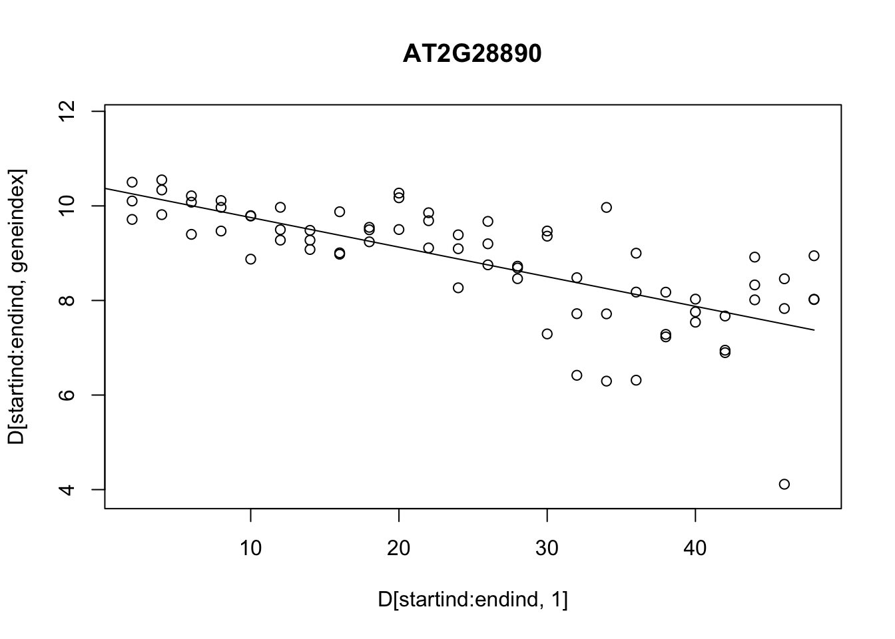
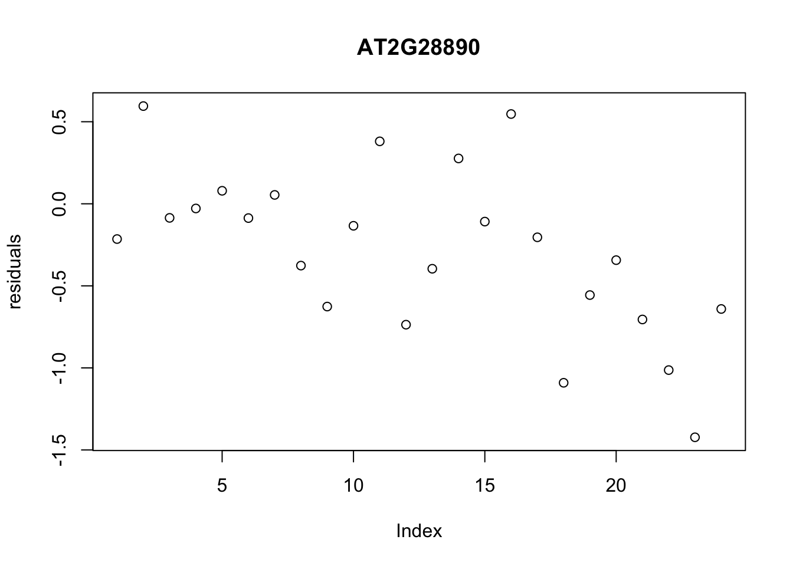
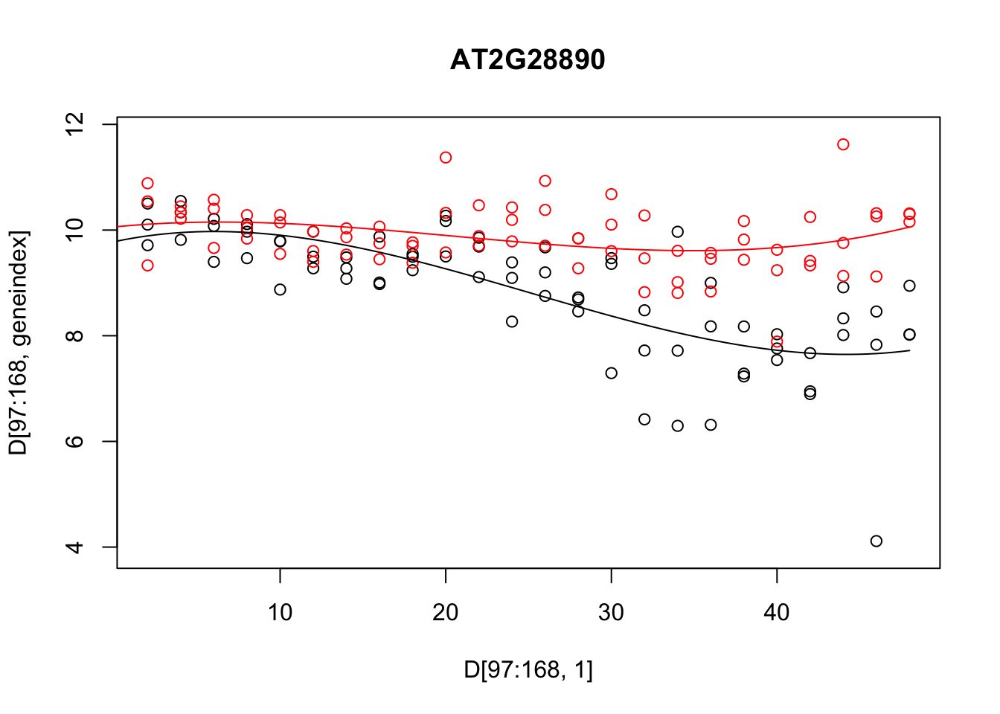
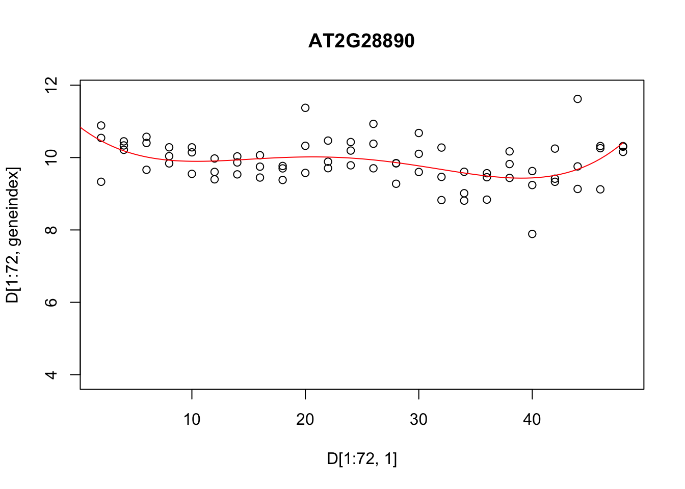
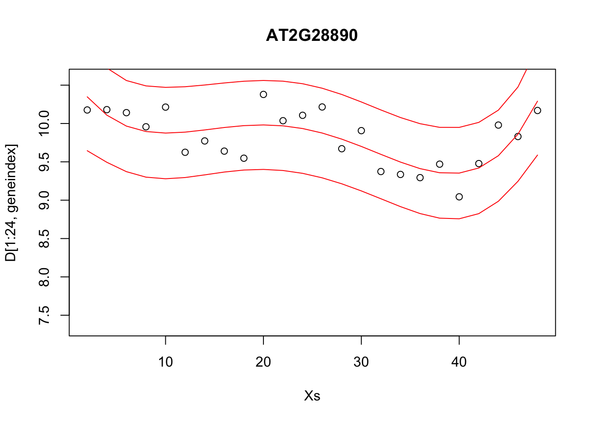
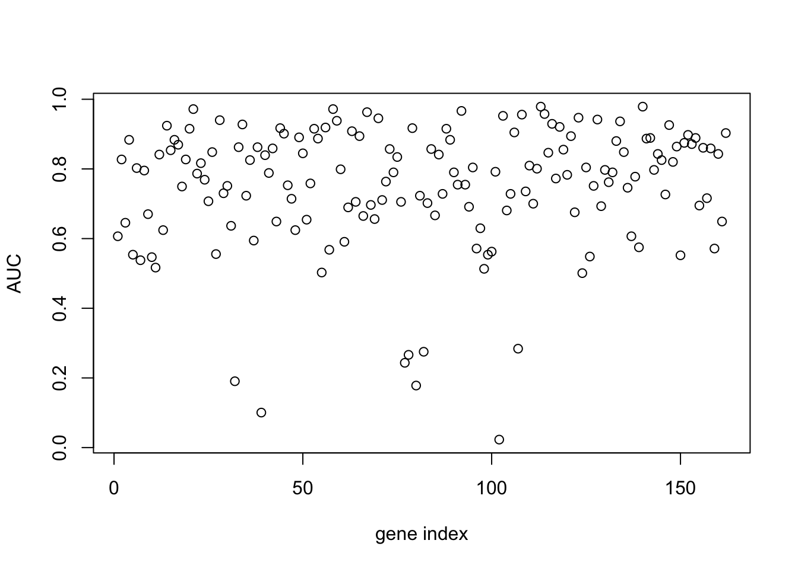

# Linear regression and logistic regression  {#logistic-regression}

Supervised learning refers to the general task of identifying how a set of annotated input data maps to a set of outcomes. In other words, it's about learning *functions* from a labelled set of data, and using those functions for prediction. The labelled data typically consists of a matched pair of observations $\{\mathbf{X},\mathbf{y}\}$, where $\mathbf{X}$ (the *input variables*) is usually a matrix of (real-valued) explanatory variables, with $\mathbf{X}_i$ denoting the $i$th column which contains observations for the $i$th variable, and $\mathbf{y} = (y_1,\ldots,y_n)^\top$ (the *output variable*) denotes a vector of observations for a variable of interest (the input variables need not be real values vectors, and could instead represent any measurement including graphs, text etc.). In general, the *input variables* are often easier or cheaper to measure, but it's the *output variables* that we're really interested in. Depending on the nature of the output variable, supervised learning is generally split into **regression** and **classification** tasks. 

Within a regression setting, we usually aim to identify how the input variables map to the (continuous-valued) output variable(s). A simple example would involve measuring the population size of a bacterial culture, $\mathbf{y} = (N_1,\ldots,N_n)^\top$, at a set of time points, $\mathbf{X} = (t_1,\ldots,t_n)^\top$, and learning the function that maps from $\mathbf{X}$ to $\mathbf{y}$. Doing so should reveal something about the physical nature of the system, such as identifying the existence of distinct phases of growth. Correctly identifying these functions would also allow us to predict the output variable, $\mathbf{y}^* = (N_i^*,\ldots,N_k^*)^\top$, at a new set of times, $\mathbf{X}^* = (t_i,\ldots,t_k)^\top$.

Classification algorithms, on the other hand, deal with discrete-valued outputs. Here each observation in $\mathbf{y} = (y_1,\ldots,y_n)$ can take on only a finite number of values. For example, we may have a measurement that indicates "infected" versus "uninfected", which can be represented in binary, $y_i \in [0,1]$. More generally we have data that falls into $K$ classes e.g., "group 1" through to "group K". As with regression, the aim is to identify how the (potentially continuous-valued) input variables map to the discrete set of class labels, and ultimately, assign labels to a new set of observations. Notable examples would be to identify how the expression levels of particular set of marker genes are predictive of a discrete phenotype. Although we do not specifically addrerss classification in this section, towards the end we will cover a regression model that can be used to perform binary classification from continuous values input data: logistic regression. Logistic regression, itself, is not a classification algorithm *per se*, but it can be used in such a context, as we will show.

In section \@ref(regression) we briefly recap linear regression. As an example, we demonstrate the use of regression to predict gene expression values as a function of time, and how this can be used to inform us about the nature of the data, and as a way to make decisions about whether there are changes in gene expression over time.Then, in section \@ref(logistic-regression1) we introduce logistic regression (section \@ref(logistic-regression)), and demonstrate how such approaches can be used to predict pathogen infection status in *Arabidopsis thaliana*, again based on gene expression levels. By doing so we identify key marker genes indicative of pathogen growth.

## Regression {#regression}

In this section, we will recap our understanding of regression. To do so will make use of an existing dataset which captures the gene expression levels in the model plant *Arabidopsis thaliana* following innoculation with *Botrytis cinerea* [@windram2012arabidopsis], a necrotrophic pathogen considered to be one of the most important fungal plant pathogens due to its ability to cause disease in a range of plants. Specifically this dataset is a time series measuring the gene expression of 100 or so genes in *Arabidopsis* leaves following inoculation with *Botrytis cinerea* over a $48$ hour time window, with observations taken at $2$ hour intervals. Whilst this example is distinctly biological in motivation the methods we discuss should be general and applicable to other collections of time series data, and it may be helpful to instead think of things in terms of *input variables* and *output variables*.

The dataset is available from GEO (GSE39597) but a pre-processed version has been deposited in the {data} folder. This pre-processed data contains the expression levels of a set of $163$ marker genes in tab delimited format. The fist row contains gene IDs for the marker genes (the individual input variables). Column $2$ contains the time points of observations, with column $3$ containing a binary indication of infection status evalutated as $0$ or $1$ according to wether there was a detectable presence of *Botrytis cinerea* tubulin protein. All subsequent columns indicate ($\log_2$) normalised *Arabidopsis* gene expression values from microarrays (V4 TAIR V9 spotted cDNA array). The expression dataset itself contains two time series: the first $24$ observations represent measurements of *Arabidopsis* gene expression in a control time series (uninfected), from $2h$ through $48h$ at $2$-hourly intervals, and therefore capture dynamic aspects natural plant processes, including circadian rhythms; the second set of $24$ observations represents an infected dataset, again commencing $2h$ after inoculation with *Botyris cinerea* through to $48h$. 

Within this section our output variable will typically be the expression level of a particular gene of interest, denoted $\mathbf{y} =(y_1,\ldots,y_n)^\top$, with the explanatory variable being time, $\mathbf{X} =(t_1,\ldots,t_n)^\top$. We can read the dataset into {R} as follows:


```r
D <- read.csv(file = "data/Arabidopsis/Arabidopsis_Botrytis_transpose_3.csv", header = TRUE, sep = ",", row.names=1)

D <- read.csv(file = "data/Arabidopsis/Arabidopsis_Botrytis_pred_transpose_3.csv", header = TRUE, sep = ",", row.names=1)
```

We can also extract out the names of the variables (gene names), and the unique vector of measurment times. For the control experiment this would look like:


```r
genenames <- colnames(D)
Xs <- D$Time[1:96]
```
whilst for the treatment, it would be

```r
genenames <- colnames(D)
Xs2 <- D$Time[97:nrow(D)]
```

Exercise 1.1. Plot the gene expression profiles to familiarise yourself with the data. No, really, plot the data. This is always the first thing you should be doing with your datasets - look at them. The general aim of this module is to give you hands on experience with linear and logistic regression and cover a number of other concepts from machine learning. The main points are:

1. Do you understand the data? A priority before doing any ML should be to look, interrogate, and understand the data. 
2. What is the data.
3. Look at the data.
4. Repeat 1-3 a few more times.
5. Once more for luck, look at the data.
6. Once we begin to understand the data, we will have a better grasp of what we are doing and what ML approaches to take. In the first example we will start with some linear regression.
7. We will explore more complicated forms of regression.
8. We will get an idea of how to partition data into training and test sets, and how in doing so we may distinguish between different types of models.
9. We will start to get an intuition for how regression tasks may be used to predict values an new locations, and why choosing the right kind of model is important.

### Linear regression {#linear-regression}

The plant dataset consists of 8 time series (4 replicated time series from a control "mock infection" and $4$ time series from an Botrytis-inoculated plant). Each time series contains 24 time points, over $48$ hours at $2$ hourly intervals. Now that we have an idea about what our dataset is, we can start to do something with it. Here we have a time series (a number of time-series, in fact), so we may, at some point, want to develop a models of how specific genes are changing over time: this would allow us to predict what gene expression might be doing at some point in the futurer (forecasting) or uncover something about the physical nature of the system i.e., what kind of function best describes the behaviour. Recall that one of the simplest forms of regression, linear regression, assumes that the variable of interest, $y$, depends on an explanatory variable, $x$, via:

$y = m x + c.$

For a typical set of data, we have a vector of observations, $\mathbf{y} = (y_1,y_2,\ldots,y_n)$ with a corresponding set of explanatory variables. For now we can assume that the explanatory variable is scalar, for example time (in hours), such that we have a set of observations, $\mathbf{X} = (t_1,t_2,\ldots,t_n)$. Using linear regression we aim to infer the parameters $m$ and $c$, which will tell us something about the relationship between the two variables, and allow us to make predictions at a new set of locations, $\mathbf{X}*$.

Within {R}, linear regression can be implemented via the {lm} function. In the example below, we perform linear regression for the gene expression of AT2G28890 as a function of time, using $3$ of the $4$ infection time series (saving the fourth for validation):


```r
linmod <- lm(AT2G28890~Time, data = D[4*24 +1:7*24,])
```

within this snippet of code, the {lm} function has analytically identified the gradient and offset ($m$ and $c$ parameters) based upon all 24 time points (4 replicates), and we can take a look at those parameters via {linmod$oefficients}. In general, it is not a very good idea to infer parameters using all of the data. Doing so would leave no way to evaluate for overfitting. Ideally, we wish to partition the dataset into a training set, and an evaluation set, with parameters evaluated on the training set, and model performance summarised over the evaluation set. We can of course partition this dataset manually, or use a package to do so. In the previous workshops we saw how {caret} machine learning wrapper could be used to easily specify various partitions of the dataset. Linear regression is implemented within the {caret} package, allowing us to make use of these utilities. In fact, within {caret}, linear regression is performed by calling the function {lm}.

In the example, below, we perform linear regression for gene AT2G28890, and predict the expression pattern for that gene using the {predict} function:

```r
library(caret)
```

```
## Warning: package 'caret' was built under R version 3.5.2
```

```
## Loading required package: lattice
```

```
## Warning: package 'lattice' was built under R version 3.5.2
```

```
## Loading required package: ggplot2
```

```r
library(mlbench)
library(ggplot2)

set.seed(1)

geneindex <- which(genenames=="AT2G28890")

startind <- (4*24)+1
endind <- 7*24

lrfit <- train(y~., data=data.frame(x=D[startind:endind,1],y=D[startind:endind,geneindex] ), method = "lm")
predictedValues<-predict(lrfit)
```

A summary of the model, including parameters, can be printed out to screen using the {summary} function:


```r
summary(lrfit)
```

```
## 
## Call:
## lm(formula = .outcome ~ ., data = dat)
## 
## Residuals:
##     Min      1Q  Median      3Q     Max 
## -3.3862 -0.3787  0.0814  0.4267  1.7164 
## 
## Coefficients:
##              Estimate Std. Error t value Pr(>|t|)    
## (Intercept) 10.380430   0.201695  51.466  < 2e-16 ***
## x           -0.062616   0.007058  -8.872 4.54e-13 ***
## ---
## Signif. codes:  0 '***' 0.001 '**' 0.01 '*' 0.05 '.' 0.1 ' ' 1
## 
## Residual standard error: 0.8291 on 70 degrees of freedom
## Multiple R-squared:  0.5293,	Adjusted R-squared:  0.5226 
## F-statistic: 78.71 on 1 and 70 DF,  p-value: 4.543e-13
```

Conveniently, in cases where we do not specify a split in the data, {caret} will split these by default settings, and can look at various metrics on the held out data in {lrfit$results}. We can make predictions at new points (for example if we are interested in forecasting at some time in the future) by specifying a new set of time points over which to make a prediction:


```r
newX <- seq(0,48,by=0.5)
forecastValues<-predict(lrfit,newdata = data.frame(x=newX) )

plot(D[startind:endind,1],D[startind:endind,geneindex],type="p",col="black",ylim=c(min(D[,geneindex])-0.2, max(D[,geneindex]+0.2)),main=genenames[geneindex])
points(newX,forecastValues,type="l",col="black")
```



We can also take a look at predictions in the held-out $4$th replicate:


```r
newX <- D[169:192,1]
forecastValues<-predict(lrfit,newdata = data.frame(x=newX) )
residuals <- forecastValues - D[169:192,geneindex]

plot(residuals, type="p",col="black",main=genenames[geneindex])
```



Let's also fit a linear model to the control dataset (again only using 3 datasets), and plot the inferred results alongside the observation data for both fitted models:


```r
newX <- seq(0,48,by=0.5)

lrfit2 <- train(y~., data=data.frame(x=D[1:72,1],y=D[1:72,geneindex]), method = "lm")
predictedValues2 <- predict(lrfit2, newdata = data.frame(x=newX))
predictedValues<-predict(lrfit,newdata = data.frame(x=newX) )

plot(D[1:72,1],D[1:72,geneindex],type="p",col="black",ylim=c(min(D[,geneindex])-0.2, max(D[,geneindex]+0.2)),main=genenames[geneindex])
points(D[97:168,1],D[97:168,geneindex],type="p",col="red")
points(newX,predictedValues,type="l",col="red")
points(newX,predictedValues2,type="l",col="black")
```


Whilst the above model appeared to do reasonably well at capturing the general trends in the dataset, if we take a closer look at the control data (in red), you may notice that, visually, there appears to be more structure to the data than indicated by the model fit. One thing we can do is take a look at the residuals fo each model: if there is structure in the residuals, it would suggest the model is not capturing the full richness of the model. Indeed, if we look AT2G28890 up on [CircadianNET](http://viridiplantae.ibvf.csic.es/circadiaNet/genes/atha/AT2G28890.html), we will see it is likely circadian in nature ($p<5\times10^{-5}$) suggesting there may be some rhythmicity to it. To better accommodate the complex nature of this data we may need something more complicated. 

### Polynomial regression

In general, linear models will not be appropriate for a large variety of datasets, particularly when the variables of interest are nonlinear. We can instead try to fit more complex models, such as a quadratic function, which has the following form:

$y = m_1 x + m_2 x^2 + c,$

where $m = [m_1,m_2,c]$ represent the parameters we're interested in inferring. An $n$th-order polynomial has the form:

$y = \sum_{i=1}^{n} m_i x^i + c.$

where $m = [m_1,\ldots,m_n,c]$ are the free parameters. Within {R} we can infer more complex polynomials to the data using the {lm} package by calling the {poly} function when specifying the symbolic model. In the example below we fit a $3$rd order polynomial (the order of the polynomial is specified via the {degree} variable):
 

```r
lrfit3 <- lm(y~poly(x,degree=3), data=data.frame(x=D[1:72,1],y=D[1:72,geneindex]))
```
 
We can do this within {caret}: in the snippet, below, we fit $3$rd order polynomials to the control and infected datasets, and plot the fits alongside the data.
 

```r
lrfit3 <- train(y~poly(x,degree=3), data=data.frame(x=D[1:72,1],y=D[1:72,geneindex]), method = "lm")
lrfit4 <- train(y~poly(x,degree=3), data=data.frame(x=D[97:168,1],y=D[97:168,geneindex]), method = "lm")

plot(D[97:168,1],D[97:168,geneindex],type="p",col="black",ylim=c(min(D[,geneindex])-0.2,max(D[,geneindex]+0.2)),main=genenames[geneindex])
points(D[1:72,1],D[1:72,geneindex],type="p",col="red")

newX <- seq(0,48,by=0.5)

predictedValues<-predict(lrfit3,newdata = data.frame(x=newX) )
predictedValues2 <- predict(lrfit4, newdata = data.frame(x=newX))

points(newX,predictedValues,type="l",col="red")
points(newX,predictedValues2,type="l",col="black")
```


 
Note that, by eye, the fit appears to be a little better than for the linear regression model. Well, maybe! We can quantify the accuracy of the models by looking at the root-mean-square error (RMSE) on the hold-out data (cross validation), defined as:

$\mbox{RMSE} = \sqrt{\sum_{i=1}^n (\hat{y_i}-y_i)^2/n}$

where $\hat{y_i}$ is the predicted value (model prediction) and $y_i$ the observed value of the $i$th (held out) datapoint.

What happens if we fit a much higher order polynomial? Try fitting a polynomial with degree $d = 12$ and plotting the result. As we increase the model complexity the fit *appears* to match perfectly well in the training set, but becomes completely useless for prediction. We are overfitting! This is why we use held out data, so that we can evaluate, empirically, when a model is useful, or when it is simply memorising the training set. 

Exercise 1.2. Using your gene of interest explore the model complexity i.e., try fitting polynomial models of increasing complexity. Plot the RMSE on the test sets as a function of degree. Which model fits best?

### Distributions of fits

In the previous section we explored fitting a polynomial function to the data. Recall that we can fit a $4$th order polynomial to the control datasets as follows:


```r
lrfit3    <- lm(y~poly(x,degree=4), data=data.frame(x=D[1:72,1],y=D[1:72,geneindex]))
plot(D[1:72,1],D[1:72,geneindex],type="p",col="black",ylim=c(min(D[,geneindex])-0.2, max(D[,geneindex]+0.2)),main=genenames[geneindex])

newX <- seq(0,48,by=0.5)
predictedValues<-predict(lrfit3,newdata = data.frame(x=newX) )

lines(newX,predictedValues,type="l",col="red")
```



It looks reasonable, but how does it compare to the following shown in blue?


```r
lrfit4 <-  lrfit3
lrfit4$coefficients <- lrfit4$coefficients + 0.1*matrix(rnorm(length(lrfit4$coefficients)),length(lrfit4$coefficients));
pred1<-predict(lrfit4, data=data.frame(x=D[1:24,1],y=D[1:24,geneindex]))


plot(D[1:72,1],D[1:72,geneindex],type="p",col="black",ylim=c(min(D[,geneindex])-0.2, max(D[,geneindex]+0.2)),main=genenames[geneindex])

newX <- seq(0,48,by=0.5)
predictedValues<-predict(lrfit3,newdata = data.frame(x=newX) )
predictedValues2<-predict(lrfit4,newdata = data.frame(x=newX) )


lines(newX,predictedValues,type="l",col="red")
lines(newX,predictedValues2,type="l",col="blue")
```


Our new fit was generated by slightly perturbing the optimised parameters via the addition of a small amount of noise. We can see that the new fit is almost as good, and will have a very similar SSE[^This should give us some intuition on the notion of over-fitting. For example, if we make a small perturbation to the parameters of a simpler model, the function will not change all that much; on the other hand, if we made a small perturbation to the parameters of a more complex polynomial, the function may look drastically different. To explain the data with the more complex model would therefore require very specific sets of parameters]. In general, inferring a single fit to a model is prone to overfitting. A much better approach is to instead fit a distribution over fits. We can generate samples from a linear model using the {coef} function. To do so we must use the {lm} function directly, and not via the {caret} package.


```r
library("arm")
```

```
## Loading required package: MASS
```

```
## Warning: package 'MASS' was built under R version 3.5.2
```

```
## Loading required package: Matrix
```

```
## Warning: package 'Matrix' was built under R version 3.5.2
```

```
## Loading required package: lme4
```

```
## Warning: package 'lme4' was built under R version 3.5.2
```

```
## 
## arm (Version 1.12-2, built: 2021-10-15)
```

```
## Working directory is /Users/christopherpenfold/Desktop/AZMachineLearning/AZCourseV2
```

```r
lrfit4    <- lm(y~poly(x,degree=4), data=data.frame(x=D[1:72,1],y=D[1:72,geneindex]))
simulate  <- coef(sim(lrfit4))
paramsamp <- head(simulate,10)
```

This will sample model parameters that are likely to explain the dataset. In this case we have produced $10$ different sets of sample parameters. In the code, below, we plot those $10$ sample polynomials:


```r
plot(D[1:72,1],D[1:72,geneindex],type="p",col="black",ylim=c(min(D[,geneindex])-0.2, max(D[,geneindex]+0.2)),main=genenames[geneindex])
for (i in c(1,2,3,4,5,6,7,8,9,10)){
lrfit4$coefficients <- paramsamp[i,]
pred1<-predict(lrfit4, newdata = data.frame(x=newX) )
lines(newX,pred1,type="l",col="red")
}
```



### Logistic regression {#logistic-regression1}

The type of linear regression models we've been using up to this point deal with real-valued observation data, $\mathbf{y}$, and are therefore not appropriate for classification. To deal with cases where $\mathbf{y}$ is a binary outcome, we instead have to think of different models. Logistic regression is one example which can be used to model data in which there is a general transition from one state to another as a function of the input variable e.g., where gene expression levels might predict disease state, with lower levels indicating disease-free, and higher-levels indicating a diseased state. Logistic regression does not perform classification *per se*, but instead models the probability of a successful event (e.g., a $1$). As probability is a real-valued number (between $0$ and $1$), technically this remains a form of regression. However, we can logistic regression to make classifications by setting thresholds on the probabilities i.e., if we decide everything with $p\ge 0.5$ is a success ($1$), and everything below is a $0$.  

Another way to think about linear regression is that we are fitting a linear model to the logit (natural log) of the log-odds ratio:

$\ln \biggl{(}\frac{p(x)}{1-p(x)}\biggr{)} = c + m_1 x_1.$

Although this model is not immediately intuitive, if we solve for $p(x)$ we get:

$p(x) = \frac{1}{1+\exp(-c - m_1 x_1)}$.

We have thus specified a function that indicates the probability of success for a given value of $x$ e.g., $P(y=1|x)$. In general can think of our data as a being a sample from a Bernoulli trial, and can therefore write down the likelihood for a set of observations ${\mathbf{X},\mathbf{y}}$:

$\mathcal{L}(c,m_1) = \prod_{i=1}^n p(x_i)^{y_i} (1-p(x_i)^{1-y_i})$.

Unlike linear regression, these models do not admit a closed form solution, but can be solved iteratively via maximum likelihood. That is by finding the values $(c,m_1)$ that return the greatest value of $\mathcal{L}(c,m_1)$. Within {caret}, logistic regression can applied using the {glm} function. 

To illustate this we will again make use of our plant dataset. Recall that the second column represents a binary variable indicative of infection status e.g., population growth of the *Botrytis cinerea* pathogen indicated by observable *Botrytis* tubulin. 

In the excercises, below, we will use logistic regression to learn a set of markers capable of predicting infection status. To begin with, let's see if *time* is informative of infection status:


```r
library(pROC)
```

```
## Warning: package 'pROC' was built under R version 3.5.2
```

```
## Type 'citation("pROC")' for a citation.
```

```
## 
## Attaching package: 'pROC'
```

```
## The following objects are masked from 'package:stats':
## 
##     cov, smooth, var
```

```r
library(ROCR)
```

```
## Loading required package: gplots
```

```
## 
## Attaching package: 'gplots'
```

```
## The following object is masked from 'package:stats':
## 
##     lowess
```

```r
options(warn=-1)
mod_fit <- train(y ~ ., data=data.frame(x = D$Time, y = as.factor(D$Class)), method="glm", family="binomial")
```

To make things easier, for model evaluation, we will load in a second (related) dataset, containing a new set of observations not seen by the model, and predict infection status on this held out data.


```r
Dpred <- read.csv(file = "data/Arabidopsis/Arabidopsis_Botrytis_transpose_3.csv", header = TRUE, sep = ",", row.names=1)

prob <- predict(mod_fit, newdata=data.frame(x = Dpred$Time, y = as.factor(Dpred$Class)), type="prob")
pred <- prediction(prob$`1`, as.factor(Dpred$Class))
```

To evaluate how well the algorithm has done, we can calculate a variety of summary statistics. For example the number of true positives, true negatives, false positives, and false negatives. A useful summary is to plot the ROC curve (false positive rate versus true positive rate) and calculate the area under the curve. Recall that for a perfect algorithm the area under this curve (AUC) will be equal to $1$, whereas random assignment would give an area of $0.5$. In the example below, we will calculate the AUC for a logistic regression model:


```r
perf <- performance(pred, measure = "tpr", x.measure = "fpr")
plot(perf)
```


```r
auc <- performance(pred, measure = "auc")
auc <- auc@y.values[[1]]
auc
```

```
## [1] 0.6111111
```

Okay, so a score of $0.61$ is certainly better than random, but not particularly good. This is perhaps not surprising, as half the time series (the control) is uninfected over the entirety of the time series, whilst in the second times series *Botrytis* is able to infect from around time point 8 onward. The slightly better than random performance therefore arises due the slight bias in the number of instances of each class. Indeed, if we plot infection status vs time, we should be able to see why the model fails to be predictive.

In the example below, we instead try to regress infection status against individual gene expression levels. The idea is to identify genes that have expression values indicative of *Botrytis* infection: marker genes.


```r
aucscore <- matrix(rep(0, 164), 1, 164)
for (i in seq(3,164)){
mod_fit <- train(y ~ ., data=data.frame(x = D[,i], y = as.factor(D$Class)), method="glm", family="binomial")
prob <- predict(mod_fit, newdata=data.frame(x = Dpred[,i], y = as.factor(Dpred$Class)), type="prob")
pred <- prediction(prob$`1`, as.factor(Dpred$Class))
perf <- performance(pred, measure = "tpr", x.measure = "fpr")
auc <- performance(pred, measure = "auc")
aucscore[i] <- auc@y.values[[1]]
}

plot(aucscore[1,3:ncol(aucscore)],ylab="AUC",xlab="gene index")
```



We note that, several genes in the list appear to have AUC scores much greater than $0.6$. We can take a look at some of the genes with high predictive power:


```r
genenames[which(aucscore>0.8)]
```

```
##  [1] "AT1G06510" "AT1G13030" "AT1G14920" "AT1G25490" "AT1G29990" "AT1G30860"
##  [7] "AT1G32230" "AT1G45145" "AT1G54060" "AT1G63860" "AT1G67170" "AT1G69690"
## [13] "AT2G04740" "AT2G21380" "AT2G27480" "AT2G28890" "AT2G34710" "AT2G35500"
## [19] "AT2G38750" "AT2G41350" "AT2G44950" "AT2G45660" "AT3G02150" "AT3G06720"
## [25] "AT3G09630" "AT3G09980" "AT3G11590" "AT3G13720" "AT3G16310" "AT3G21490"
## [31] "AT3G25710" "AT3G44720" "AT3G48150" "AT3G49570" "AT3G50910" "AT3G54170"
## [37] "AT3G60600" "AT3G61790" "AT4G00710" "AT4G00980" "AT4G02150" "AT4G04020"
## [43] "AT4G16380" "AT4G17710" "AT4G19700" "AT4G25200" "AT4G26110" "AT4G26450"
## [49] "AT4G28640" "AT4G32190" "AT4G32570" "AT4G34710" "AT4G35580" "AT4G36970"
## [55] "AT4G39050" "AT5G02150" "AT5G11980" "AT5G19480" "AT5G19990" "AT5G20000"
## [61] "AT5G22630" "AT5G24660" "AT5G25070" "AT5G42980" "AT5G43700" "AT5G50010"
## [67] "AT5G51110" "AT5G51910" "AT5G56250" "AT5G56290" "AT5G56950" "AT5G57210"
## [73] "AT5G59670" "AT5G61390" "AT5G66200" "AT5G66560"
```

Unsurprisingly, among these genes we see a variety whose proteins are known to be targeted by various pathogen effectors, and are therefore directly implicated in the immune response (Table 1). 

Gene | Effector
--- | ---
AT3G25710	|	ATR1_ASWA1
AT4G19700	|	ATR13_NOKS1
AT4G34710	|	ATR13_NOKS1
AT4G39050	|	ATR13_NOKS1
AT5G24660	|	ATR13_NOKS1
AT4G00710	|	AvrRpt2_Pto JL1065_CatalyticDead
AT4G16380	|	HARXL44
AT2G45660	|	HARXL45
AT5G11980	|	HARXL73
AT2G35500	|	HARXLL445
AT1G67170	|	HARXLL470_WACO9
AT4G36970	|	HARXLL470_WACO9
AT5G56250	|	HARXLL470_WACO9
AT3G09980	|	HARXLL516_WACO9
AT5G50010	|	HARXLL60
AT3G44720	|	HARXLL73_2_WACO9
AT5G22630	|	HARXLL73_2_WACO9
AT5G43700	|	HopH1_Psy B728A
Table 1: Genes predictive of infection status of *Botrytis cinerea* whose proteins are targeted by effectors of a variety of pathogens

Let's take a look at what the data looks like. In this case we plot the training data labels and the fit from the logistic regression i.e., $p(\mathbf{y}=1|\mathbf{x})$:


```r
bestpredictor <- which(aucscore==max(aucscore))[1]

best_mod_fit <- train(y ~., data=data.frame(x = D[,bestpredictor], y = as.factor(D$Class)), family="binomial", method="glm")

plot(Dpred[,bestpredictor],Dpred$Class,xlab=genenames[bestpredictor],ylab="Class")
lines(seq(min(Dpred[,bestpredictor]),max(Dpred[,bestpredictor]),length=200),predict(best_mod_fit,newdata=data.frame(x = seq(min(Dpred[,bestpredictor]),max(Dpred[,bestpredictor]),length=200)),type="prob")[,2])
```


We can see from this plot that the level of AT4G26450 appears to be highly predictive of infection status. When AT4G26450 is lowly expressed, its almost certain that the *Botrytis cinerea* has gained a foothold; whether this is causal or not, we cannot say, but it is almost certainly a good marker.  

Linear regression and logistic regression represent useful tools for dissecting relationships among variables, and are frequently used as tools to interpret complex datasets. There are some cases where linear approaches may not work so well, however. To illustrate this we will construct an artificial dataset in which low expression levels of a gene indicates no infection, with moderate levels indicating infection; very high levels of the gene, however, do not indicate infected status, but might only arise artificially, due to e.g., inducible overexpression. For this dataset very high levels are thus labeled as uninfected. Below we construct this *in silico* dataset based loosely on the expression levels of AT3G44720.


```r
xtrain = D[,bestpredictor] 

ytrain = as.numeric(D$Class)
ytrain[which(xtrain>11.5)]=0
ytrain[which(xtrain<10)]=0
ytrain = as.factor(ytrain)

xpred = Dpred[,bestpredictor] 
ypred = as.numeric(Dpred$Class)
ypred[which(xpred>11.5)]=0
ypred[which(xpred<10)]=0
ypred = as.factor(ypred)
```

Let's fit a logistic model and visualise the result:


```r
mod_fit3 <- train(y ~., data=data.frame(x = xtrain, y= as.factor(ytrain)), family="binomial", method = "glm")

plot(xtrain,as.numeric(ytrain)-1,xlab="Marker gene",ylab="Class")

lines(seq(min(xtrain),max(xtrain),length=200),predict(mod_fit3,newdata=data.frame(x = seq(min(xtrain),max(xtrain),length=200),y= matrix(200,1,1)),type="prob")[,2])
```


```r
mod_fit3$results$Accuracy
```

```
## [1] 0.6575513
```

We can see from the plot that the model fit is very poor. However, if we look at the accuracy (printed at the bottom) the result appears to be good. This is due to the skewed number of samples from each class: there are far more uninfected samples than there are infected, which means that if the model predicts uninfected for every instance, it will be correct more than it's incorrect. We can similarly check the result on our test dataset:


```r
prob<-predict(mod_fit3, newdata=data.frame(x =xpred, y = as.factor(ypred)), type="prob")
pred <- prediction(prob[,2], ypred)
perf <- performance(pred, measure = "tpr", x.measure = "fpr")
auc <- performance(pred, measure = "auc")
auc <- auc@y.values[[1]]
auc
```

```
## [1] 0.978836
```

These results indicates two key issues. Class imbalance can be a particular problem in regression approaches, and it is important to monitor this on a practical level. Things that we can do, depending on the dataset and method, include up-weighting the less frequently sampled class, or discarding more of the dominant class. Other metrics may also be more appropriate that AUC when classes are highly unbalanced, including area under precision-recall curves.

Secondly, nonlinearities in a dataset can be problematic for both linear regression and logistic regression, and a variety of approaches exist for tackling such problems under the umbrella term of nonlinear regression.

## Resources

A variety of examples using {caret} to perform regression and classification have been implemented 
[here](https://github.com/tobigithub/caret-machine-learning).

For those that want to start their own reading on nonlinear regression, a good stating point is Rasmussen and William's book on [Gaussian processes](http://www.gaussianprocess.org/gpml/chapters/RW.pdf). Be warned, it will contain a lot more maths than this course.

=======
## Exercises

Solutions to exercises can be found in appendix \@ref(solutions-logistic-regression).
