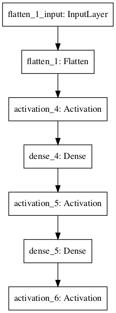
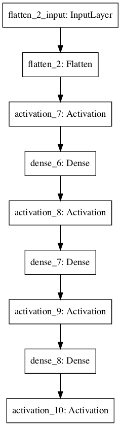
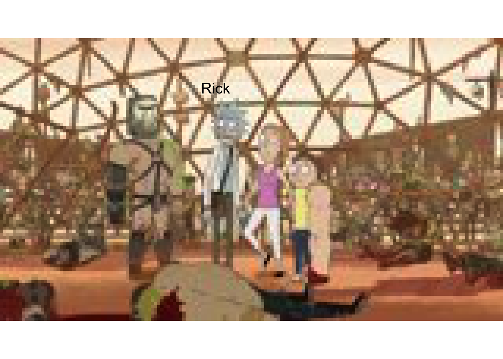

# Deep Learning {#mlnn}

<!-- Chris -->

## Multilayer Neural Networks

Neural networks with multiple layers are increasingly used to attack a variety of complex problems in biology under the umbrella of *deep learning* [@angermueller2016deep,@Mohammad2019deep]. This umbrella contains an incredibly diverse range of techniques, including densely connected networks (which are essentially complex counterparts to the traditional perceptron), convolutional neural networks (CNN), autoencoders (AE), and adversarial neural networks (ANN), amongst others. 

In this section we will explore the basics of *deep learning* on a practical level. We will first learn how to construct a neural network using {KerasR}. We will first use densely connected neural networks to explore a regression setting, before trying our hand at image classification using a set of images taken from the animated TV series [Rick and Morty](https://en.wikipedia.org/wiki/Rick_and_Morty). For those unfamiliar with Rick and Morty, the series revolves around the adventures of Rick Sanchez, an alcoholic, arguably sociopathic scientist, and his neurotic grandson, Morty Smith. Although many scientists aspire to be like Rick, they're usually more like a Jerry. Our motivating goal in this latte section is to develop an image classification algorithm capable of telling us whether any given image contains Rick or not: a binary classification task with two classes, *Rick* or *not Rick*. For training purposes I have downloaded several thousand random images of Rick and several thousand images without Rick from the website [Master of All Science](https://masterofallscience.com).

The main ideas to take home from this section are:

1. Look at the data.
2. There are a limitless variety of architectures that can be built into a neural network. Picking one to use is often arbitrary or *at best* empirically-motivated by previous works.
3. Some approaches are better suited for specific datasets.

### Constructing Neural Networks with KerasR

Before we get to our main task, we will first have a go at building simple densely connected Neural Networks (NN) to perform regression. In general the nature of the NN we use will be motivated by the dataset we have and the question we're interested in. As a gentle intoduction, we aim to use NNs to calculate the square root of a number. We first generate training and evaluation dataset. For the training set we generate two arrays, an *input* array, containing a random set of numbers (between $0$ and $100$), and an *output* array, containing the square roots of those numbers (a similar set will be independently generated for the test set):


```r
library(keras)
library(jpeg)
```

```
## Warning: package 'jpeg' was built under R version 3.5.2
```

```r
library(grid)
library(kerasR)
```

```
## successfully loaded keras
```

```
## 
## Attaching package: 'kerasR'
```

```
## The following objects are masked from 'package:keras':
## 
##     normalize, pad_sequences, text_to_word_sequence, to_categorical
```

```r
tdims <- 50 #Number of samples to generate
x <-  runif(tdims, min=0, max=100) #Generate random x in range 0 to 100
y <- sqrt(x) #Calculate square root of x

trainingX  <- array(0, dim=c(tdims,1)) #Store data as an array (required by Keras)
trainingX[1:tdims,1] <- x
trainingY  <- array(0, dim=c(tdims,1))
trainingY[1:tdims,1] <- y

#Now do the same but for a independently generated test set
x <-  runif(tdims, min=0, max=100)
y <- sqrt(x)

testingX  <- array(0, dim=c(tdims,1)) #Store as arrays
testingX[1:tdims,1] <- x
testingY  <- array(0, dim=c(tdims,1))
testingY[1:tdims,1] <- y
```

A user friendly package for *neural networks* is available via [keras](https://keras.io), an application programming interface (API) written in Python, which uses either [theano](http://deeplearning.net/software/theano/) or [tensorflow](https://www.tensorflow.org) as a back-end. An R interface for keras is available in the form of [kerasR](https://cran.r-project.org/web/packages/kerasR/index.html). Before we can use {kerasR} we first need to load the {keras} and {kerasR} libraries in R (prior to this we also have to install pyhton package {keras} and either {theano} or {tensorflow}).

And so we come to specifying the model itself. Keras has an simple and intuitive way of specifying [layers](https://keras.io/layers/core/) of a neural network, and kerasR makes good use of this. We first initialise the model:


```r
mod <- Sequential()
```

This tells keras that we're using the Sequential API i.e., a network with the first layer connected to the second, the second to the third and so forth, which distinguishes it from more complex networks possible using the Model API. Once we've specified a sequential model, we can start adding layers to the neural network. 

A standard layer of neurons, can be specified using the {Dense} command: the first layer of our network must also include the dimension of the input data. So, for example, if our input data was a scalar, we could add an input layer via:


```r
mod$add(Dense(100, input_shape = c(1)))
```

We also need to specify the activation function to the next level. This can be done via {Activation()}, so our snippet of code using a Rectified Linear Unit (relu) activation would look something like:


```r
mod$add(Dense(100, input_shape = c(1)))
mod$add(Activation("relu"))
```

This is all we need to specify a single layer of the neural network. We could add another layer of $120$ neurons via:


```r
mod$add(Dense(120))
mod$add(Activation("relu"))
```

Finally, we should add the output neurons. The number of output neurons will differ, but should match the size of the output we're aiming to predict. In this section we have one output, a scalar representing the square root of the input, so will have a {Dense(1)} output. The final activation function also depends on the nature of our data. If, for example, we're doing regression, we can explicitly specify a {linear} activation function. Our final model would look like:


```r
mod <- Sequential()
mod$add(Dense(100, input_shape = c(1)))
mod$add(Activation("relu"))
mod$add(Dense(120))
mod$add(Activation("relu"))
mod$add(Dense(1))
mod$add(Activation("linear"))
```

That's it. Simple!

Next, we can print a summary of the network, to visualise how many parameters it has and other aspects:


```r
mod
```

```
## Model
## ________________________________________________________________________________
## Layer (type)                        Output Shape                    Param #     
## ================================================================================
## dense_1 (Dense)                     (None, 100)                     200         
## ________________________________________________________________________________
## activation_1 (Activation)           (None, 100)                     0           
## ________________________________________________________________________________
## dense_2 (Dense)                     (None, 120)                     12120       
## ________________________________________________________________________________
## activation_2 (Activation)           (None, 120)                     0           
## ________________________________________________________________________________
## dense_3 (Dense)                     (None, 1)                       121         
## ________________________________________________________________________________
## activation_3 (Activation)           (None, 1)                       0           
## ================================================================================
## Total params: 12,441
## Trainable params: 12,441
## Non-trainable params: 0
## ________________________________________________________________________________
```

Before we can perform inference, we need to compile and run the model. In this case we need to specify three things:

* A [loss](https://keras.io/losses/) function, which specifies the objective function that the model will try to minimise. A number of existing loss functions are built into keras, including the mean squared error (mean_squared_error) for regression, and categorical cross entropy (categorical_crossentropy), which is used for categorical classification. Since we are dealing with regression, we will stick with the mean squared error. 

* An [optimiser](https://keras.io/optimizers/), which determines how the loss function is optimised. Possible examples include stochastic gradient descent ({SGD()}) and Root Mean Square Propagation ({RMSprop()}).

* A list of [metrics](https://keras.io/metrics/) to return. These are additional summary statistics that keras evaluates and prints. For classification, a good choice would be accuracy (or {binary_accuracy}).

We can compile our model using {keras_compile}:


```r
keras_compile(mod,  loss = 'mean_squared_error', metrics = c('mean_squared_error'), optimizer = RMSprop())
```

Finally the model can be fitted to the data. When doing so we additionally should specify the validation set (if we have one), the batch size, and the number of epochs, where an epoch is one forward pass and one backward pass of all the training examples, and the batch size is the number of training examples in one forward/backward pass. You may want to go and get a tea whilst this is running!


```r
set.seed(12345)
keras_fit(mod, trainingX, trainingY, validation_data = list(testingX, testingY), batch_size = 100, epochs = 25, verbose = 1)
```

We can see that the mean square error rapidly decreases (from approx. 39 at epoch 1 to around 1.7 at epoch 22). Let's visualise the data versus the real values.


```r
newX <- as.matrix(seq(from = 0, to = 200, by = 5))

predY <- keras_predict(mod, x = newX)

plot(newX,predY)
lines(newX,sqrt(newX))
```


It's not particularly good. However, we didn't use a particularly large training set and there are a few things we can do to try to optimise the network. Another important point is that we didn't use the *best* network (the one with the best test set error). By default when we call prediction functions we tend to use whatever the final network was during our training. We will later learn how to save the best network, so that we can load it in for prediction. For now we will continue on.

Exercise 2.1: Try varying a few other things to get an idea of how NNs behave using keras. Try increasing the training set size, add or remove layers, and change their size. Another thing thing that can be varied is final layer activation. The [keras manual]{https://keras.io/api/layers/activations/} should provide a useful resource to explore what options are available.  

### Image classification with Rick and Morty

We will now try to train a network for image classification. As with any machine learning application, it's important to both have some question in mind (in this case "can we identify images that contain Rick Sanchez"), and understand the dataset(s) we're using.

The image data can be found in the directory {data/RickandMorty/data/}. We begin by loading in some images of Rick using the {readJPEG} and {grid.raster} functions.


```r
im <- readJPEG("data/RickandMorty/data/AllRickImages/Rick_1.jpg")
grid::grid.newpage()
grid.raster(im, interpolate=FALSE, width = 0.5)
```


Let's understand take a closer look at this dataset. We can use the funciton {dim(im)} to return the image dimensions. In this case each image is stored as a jpeg file, with $90 \times 160$ pixel resolution and $3$ colour channels (RGB). This loads into R as $160 \times 90 \times 3$ array. We could start by converting the image to grey scale, reducing the dimensions of the input data. However, each channel will potentially carry novel information, so ideally we wish to retain all of the information. You can take a look at what information is present in the different channels by plotting them individually using e.g., {grid.raster(im[,,3], interpolate=FALSE)}. Whilst the difference is not so obvious here, we can imagine sitations where different channels could be dramamtically different, for example, when dealing with remote observation data from satellites, where we might have visible wavelength alongside infrared and a variety of other spectral channels.

Since we plan to retain the channel information, our input data is a tensor of dimension $90 \times 160 \times 3$ i.e., height x width x channels. Note that this ordering is important, as the the package we're using expects this ordering (be careful, as other packages can expect a different ordering). 

Before building a neural network we first have to load the data and construct a training, validation, and test set of data. Whilst the package we're using has the ability to specify this on the fly, I prefer to manually seperate out training/test/validation sets, as it makes it easier to later debug when things go wrong. 

First load all *Rick* images and all *not Rick* images from their directory. We can get a list of all the *Rick* and *not Rick* images using {list.files}:


```r
files1 <- list.files(path = "data/RickandMorty/data/AllRickImages/", pattern = "jpg")
files2 <- list.files(path = "data/RickandMorty/data/AllMortyImages/", pattern = "jpg")
```

After loading the lsit of files we can see we have $2211$ images of *Rick* and $3046$ images of *not Rick*. Whilst this is a slightly unbiased dataset it is not dramatically so; in cases where there is extreme inbalance in the number of class observations we may have to do something extra, such as data augmentation, or assinging weights during training.

We next preallocate an empty array to store these training images for the *Rick* and *not Rick* images (an array of dimension $5257 \times 90 \times 160 \times 3$):


```r
allX  <- array(0, dim=c(length(files1)+length(files2),dim(im)[1],dim(im)[2],dim(im)[3]))
```

We can load images using the {readJPEG} function:


```r
for (i in 1:length(files1)){
  allX[i,1:dim(im)[1],1:dim(im)[2],1:dim(im)[3]] <- readJPEG(paste("data/RickandMorty/data/AllRickImages/", files1[i], sep=""))
}
```

Similarly, we can load the *not Rick* images and store in the same array:


```r
for (i in 1:length(files2)){
  allX[i+length(files1),1:dim(im)[1],1:dim(im)[2],1:dim(im)[3]] <- readJPEG(paste("data/RickandMorty/data/AllMortyImages/", files2[i], sep=""))
}
```

Next we can construct a vector of length $5257$ containing the classification for each of the images e.g., a $0$ if the image is a *Rick* and $1$ if it is *not Rick*. This is simple enough using the function {rbind}, as we know the first $2211$ images were *Rick* and the second lot of images are *not Rick*. Since we are dealing with a classification algorithm, we next convert the data to binary categorical output (that is, a *Rick* is now represented as $[1, 0]$ and a *not Rick* is a $[0, 1]$), which we can do using the {to_categorical} conversion function:


```r
#library(reticulate)
#reticulate::use_python('/usr/bin/python3')
#library(kerasR)
labels <- rbind(matrix(0, length(files1), 1), matrix(1, length(files2), 1))
allY <- to_categorical(labels, num_classes = 2)
```

Obviously in the snippet of code above we have $2$ classes; we could just as easily perform classificaiton with more than $2$ classes, for example if we wanted to classify *Ricky*, *Morty*, or *Jerry*, and so forth.

We must now split our data in training sets, validation sets, and test sets. In fact I have already stored some seperate "test" set images in another folder that we will load in at the end, so here we only need to seperate images into training and validation sets. It's important to note that we shouldn't simply take the first $N$ images for training with the remainder used for validation/testing, since this may introduce artefacts. For example, here we've loaded in all the *Rick* images in first, with the *not Rick* images loaded in second: if we took, say, the first $2000$ images for training, we would be training with only Rick images, which makes our task impossible, and our algorithm will fail catastrophically.

Although there are more elegant ways to shuffle data using {caret}, here we are going to manually randomly permute the data, and then take the first $4000$ permuted images for training, with the remainder for validation (Note: it's crucial to permute the $Y$ data in the same way).


```r
set.seed(12345) #Set random number generator for the session

vecInd <- seq(0,length(files1)+length(files2)) #A vector of indexes
trainInd <- sample(vecInd)[1:4001] #Permute and take first 4000 training
valInd <- setdiff(vecInd,trainInd) #The remainder are for val/testing

trainX <- allX[trainInd, , , ]
trainY <- allY[trainInd, 1]

valX <- allX[valInd, , , ]
valY <- allY[valInd, 1]
```

Before we move on, take a moment to think about the form of our data, in particular the output data Y. What exactly is the format we've settled on? This will be important later on in specifying our loss function. Think about cases where using similar datasets, we might want the data in a slightly different format.

We are almost ready to begin building our neural networks. First can try a few things to make sure out data has been processed correctly. For example, try manually plotting several of the images and seeing if the labels are correct. Manually print out the image matrix (not a visualisation of it): think about the range of the data, and whether it will need normalising. Finally we can check to see how many of each class is in the training and validation datasets. In this case there are $1706$ images of *Rick* and $2294$ images of *not Rick* in the training dataset. Again, whilst there is some slight class inbalance it is not terrible, so we don't need to perform data augmentation or assign weights to the different classes during training. 


### Rick and Morty classifier using Deep Learning

Let us return to our example of image classification. We start by specifying a sequential network as before.


```r
mod <- Sequential()
```

Our data is slightly different to the usual inputs we've been dealing with: that is, we're not dealing with an input vector, but instead have an array. In this case each image is a $90 \times 160 \time 3$ array. So for our first layer we first have to flatten this down using {Flatten()}:


```r
mod$add(Flatten(input_shape = c(90, 160, 3)))
```

This should turn our $90 \times \160 \times 3$ input into a $1 \times 43200$ node input. We now add an intermediate layer containing $100$ neurons, connected to the input layer with rectified linear units ({relu}):


```r
mod$add(Activation("relu"))
mod$add(Dense(100))
```

Finally we connect this layer over the final output layer (two neurons) with sigmoid activation:
[activation](https://keras.io/activations/)


```r
mod$add(Activation("relu"))
mod$add(Dense(1))
mod$add(Activation("sigmoid"))
```

The complete model should look something like:


```r
mod <- Sequential()
mod$add(Flatten(input_shape = c(90, 160, 3)))
mod$add(Activation("relu"))
mod$add(Dense(100))
mod$add(Activation("relu"))
mod$add(Dense(1))
mod$add(Activation("sigmoid"))
```

We can visualise this model using the {plot_model} function (Figure \@ref(fig:examplenet)).


```r
plot_model(mod,'images/DNN1.png')
```

<div class="figure" style="text-align: center">

<p class="caption">(\#fig:examplenet)Example of a multilayer convolutional neural network</p>
</div>

We can also print a summary of the network, for example to see how many parameters it has:


```r
mod
```

```
## Model
## ________________________________________________________________________________
## Layer (type)                        Output Shape                    Param #     
## ================================================================================
## flatten_1 (Flatten)                 (None, 43200)                   0           
## ________________________________________________________________________________
## activation_4 (Activation)           (None, 43200)                   0           
## ________________________________________________________________________________
## dense_4 (Dense)                     (None, 100)                     4320100     
## ________________________________________________________________________________
## activation_5 (Activation)           (None, 100)                     0           
## ________________________________________________________________________________
## dense_5 (Dense)                     (None, 1)                       101         
## ________________________________________________________________________________
## activation_6 (Activation)           (None, 1)                       0           
## ================================================================================
## Total params: 4,320,201
## Trainable params: 4,320,201
## Non-trainable params: 0
## ________________________________________________________________________________
```

In this case we see a total of $4,320,201$ parameters. Yikes, that's a lot of parameters to tune, and not much data! 

Next we need to compile and run the model. In this case we need to specify the loss, optimiser, and metrics. Since we are dealing with binary classification, we will use binary cross entropy (binary_crossentropy) and for classification, a good choice of metrics would be accuracy (or {binary_accuracy}). We can compile our model using {keras_compile}:


```r
keras_compile(mod,  loss = 'binary_crossentropy', metrics = c('binary_accuracy'), optimizer = RMSprop())
```

Finally the model can be fitted to the data. When doing so we additionally need to specify the validation set (if we have one), the batch size and the number of epochs, where an epoch is one forward pass and one backward pass of all the training examples, and the batch size is the number of training examples in one forward/backward pass. You may want to go and get a tea whilst this is running!


```r
set.seed(12345)
keras_fit(mod, trainX, trainY, validation_data = list(valX, valY), batch_size = 500, epochs = 25, verbose = 1)
```

For this model we achieved an accuracy of above $0.57$ on the validation dataset at epoch $25$ (which had a corresponding accuracy $>0.58$ on the training set). Not great is an understatement. In fact, if we consider the slight imbalance in the number of classes, a niave algorithm that always assigns the data to *not Rick* would achieve an accuracy of $0.58$ and $0.57$ in the training and validation sets respectively. Another striking observation is that the accuracy itself doesn't appear to be changing much during training: a possible sign that something is amiss.

Let's try adding in another layer to the network, just to see what happens. Before we do so, another important point to note is that the model we have at the end of training is the one one we generated for the latest epoch, which is not necessarily the model that gives us the best validation accuracy. Since our aim is to have the best predictive model we will also have to introduce a *callback*.

In the snippet of code, below, we contruct a new network, with an additional layer containing $70$ neurons, and introduce a *callback* that returns the best model at the end of our training:


```r
mod <- Sequential()
mod$add(Flatten(input_shape = c(90, 160, 3)))
mod$add(Activation("relu"))
mod$add(Dense(100))
mod$add(Activation("relu"))
mod$add(Dense(70))
mod$add(Activation("relu"))
mod$add(Dense(1))
mod$add(Activation("sigmoid"))

callbacks <- list(ModelCheckpoint('data/RickandMorty/data/models/model.h5', monitor = "val_binary_accuracy", verbose = 0, save_best_only = TRUE, save_weights_only = FALSE, mode = "auto", period = 1))

keras_compile(mod,  loss = 'binary_crossentropy', metrics = c('binary_accuracy'), optimizer = RMSprop())

set.seed(12345)
keras_fit(mod, trainX, trainY, validation_data = list(valX, valY), batch_size = 500, epochs = 25, callbacks = callbacks, verbose = 1)
```

We can again visualise the model:


```r
plot_model(mod,'images/DNN2.png')
```

<div class="figure" style="text-align: center">

<p class="caption">(\#fig:examplenet2)Example of a multilayer convolutional neural network</p>
</div>

Note that we can load a saved model in using the {keras_load} function:

```r
mod = keras_load('data/RickandMorty/data/models/model.h5')
```

However, the validation accuracy of this model is around $0.57$. It seems like we're getting nowhere fast, and need to change tactic. 

We need to think a little more about what the data actually *is*. In this case we're looking at a set of images. As Rick Sanchez can appear almost anywhere in the image, there's no reason to think that a given input node should correspond in two different images, so it's not surprising that the network did so badly, this is simply a task that a densely connected network is poor at. We need something that can extract out features from the image irregardless of where Rick is. There are approaches build precisely for image analysis that do just this: convolutional neural networks. 

## Convolutional neural networks

Convolutional neural networks essentially scan through an image and extract out a set of feature representations. In multilayer neural networks, these features might then be passed on to deeper layer (other convolutional layers or standard neurons) which extract out higher order features, as shown in Figure \@ref(fig:covnet). Finally, a densly connected network acts to combine features together for prediction. At least in an idealised description of what's going on.

<div class="figure" style="text-align: center">

<p class="caption">(\#fig:covnet)Example of a multilayer convolutional neural network</p>
</div>

In kerasR we can add a convolutional layer using {Conv2D}. A multilayer convolutional neural network might look something like:


```r
mod <- Sequential()
mod$add(Conv2D(filters = 20, kernel_size = c(5, 5),input_shape = c(90, 160, 3)))
mod$add(Activation("relu"))
mod$add(MaxPooling2D(pool_size=c(3, 3)))
mod$add(Conv2D(filters = 20, kernel_size = c(5, 5)))
mod$add(Activation("relu"))
mod$add(MaxPooling2D(pool_size=c(3, 3)))
mod$add(Conv2D(filters = 64, kernel_size = c(5, 5)))
mod$add(Activation("relu"))
mod$add(MaxPooling2D(pool_size=c(3, 3)))
mod$add(Flatten())
mod$add(Dense(100))
mod$add(Activation("relu"))
mod$add(Dropout(0.3))
mod$add(Dense(1))
mod$add(Activation("sigmoid"))

callbacks <- list(ModelCheckpoint('data/RickandMorty/data/models/convmodel.h5', monitor = "val_binary_accuracy", verbose = 0, save_best_only = TRUE, save_weights_only = FALSE, mode = "auto", period = 1))

keras_compile(mod,  loss = 'binary_crossentropy', metrics = c('binary_accuracy'), optimizer = RMSprop())
set.seed(12345)
keras_fit(mod, trainX, trainY, validation_data = list(valX, valY), batch_size = 100, epochs = 25, callbacks = callbacks, verbose = 1)
```

In the above, we have also included an additional callback, which plots the model performence as we progress. Again we can visualise this network:


```r
plot_model(mod,'images/DNN3.png')
```

<div class="figure" style="text-align: center">

<p class="caption">(\#fig:examplenet3)Example of a multilayer convolutional neural network</p>
</div>

Okay, so now we have achieved a better accuracy: we have an accuracy of $0.91$ on the validation dataset at epoch $24$, with a training accuracy of $0.98$. Whilst this is still not great (compared to how well a human could do on a similar task), it's accurate enough to begin making predictions and visualising the results. First load in the best model:


```r
mod = keras_load('data/RickandMorty/data/models/convmodel.h5')
```

We can use this model to make predictions for images not present in either the training or validation datasets. We load in the new set of images, which can be found in the {predictions} subfolder:


```r
files <- list.files(path = "data/RickandMorty/data/predictions/",pattern = "jpg")
predictX  <- array(0,dim=c(length(files),90,160,3))
for (i in 1:length(files)){
  x <- readJPEG(paste("data/RickandMorty/data/predictions/", files[i],sep=""))
  predictX[i,1:90,1:160,1:3] <- x[1:90,1:160,1:3]
}
```

A hard classification can be assigned using the {keras_predict_classes} function, whilst the actual probability of assignment to either class can be evaluated using {keras_predict_proba} (this can be useful for images that might be ambiguous).


```r
probY <- keras_predict_proba(mod, predictX)
predictY <- keras_predict_classes(mod, predictX)
```

We can plot an example:


```r
choice = 13
grid::grid.newpage()
if (predictY[choice]==1) {
  grid.raster(predictX[choice,1:90,1:160,1:3], interpolate=FALSE)
  grid.text(label='Rick',x = 0.4, y = 0.77,just = c("left", "top"), gp=gpar(fontsize=15, col="black"))
} else {
  grid.raster(predictX[choice,1:90,1:160,1:3], interpolate=FALSE)
  grid.text(label='Not Rick',x = 0.4, y = 0.77,just = c("left", "top"), gp=gpar(fontsize=15, col="grey"))
}
```




```r
choice = 1
grid::grid.newpage()
if (predictY[choice]==1) {
  grid.raster(predictX[choice,1:90,1:160,1:3], interpolate=FALSE)
  grid.text(label='Rick',x = 0.4, y = 0.77,just = c("left", "top"), gp=gpar(fontsize=15, col="black"))
} else {
  grid.raster(predictX[choice,1:90,1:160,1:3], interpolate=FALSE)
  grid.text(label='Not Rick',x = 0.4, y = 0.77,just = c("left", "top"), gp=gpar(fontsize=15, col="black"))
}
```


```r
choice = 6
grid::grid.newpage()
if (predictY[choice]==1) {
  grid.raster(predictX[choice,1:90,1:160,1:3], interpolate=FALSE)
  grid.text(label='Rick',x = 0.4, y = 0.77,just = c("left", "top"), gp=gpar(fontsize=15, col="black"))
} else {
  grid.raster(predictX[choice,1:90,1:160,1:3], interpolate=FALSE)
  grid.text(label='Not Rick',x = 0.4, y = 0.77,just = c("left", "top"), gp=gpar(fontsize=15, col="black"))
}
```


```r
grid::grid.newpage()
choice = 16
if (predictY[choice]==1) {
  grid.raster(predictX[choice,1:90,1:160,1:3], interpolate=FALSE)
  grid.text(label='Rick',x = 0.4, y = 0.77,just = c("left", "top"), gp=gpar(fontsize=15, col="black"))
} else {
  grid.raster(predictX[choice,1:90,1:160,1:3], interpolate=FALSE)
  grid.text(label='Not Rick: must be a Jerry',x = 0.2, y = 0.77,just = c("left", "top"), gp=gpar(fontsize=15, col="yellow"))
}
```


### Checking the models

Although our model seems to be doing reasonably, it always helps to see where things are going wrong. Let's take a look at a few of the false positives and a few of the false negatives.


```r
probvalY <- keras_predict_proba(mod, valX)
predictvalY <- keras_predict_classes(mod, valX)

TP <- which(predictvalY==1 & valY==1)
FN <- which(predictvalY==0 & valY==1)
TN <- which(predictvalY==0 & valY==0)
FP <- which(predictvalY==1 & valY==0)
```

Let's see where we go it right:


```r
grid::grid.newpage()
grid.raster(valX[TP[1],1:90,1:160,1:3], interpolate=FALSE, width = 0.3, x = 0.5, y=0.2)
grid.raster(valX[TP[2],1:90,1:160,1:3], interpolate=FALSE, width = 0.3, x = 0.5, y=0.5)
grid.raster(valX[TP[3],1:90,1:160,1:3], interpolate=FALSE, width = 0.3, x = 0.5, y=0.8)
```


And wrong (false negative):


```r
grid::grid.newpage()
grid.raster(valX[FN[1],1:90,1:160,1:3], interpolate=FALSE, width = 0.3, x = 0.5, y=0.2)
grid.raster(valX[FN[2],1:90,1:160,1:3], interpolate=FALSE, width = 0.3, x = 0.5, y=0.5)
grid.raster(valX[FN[3],1:90,1:160,1:3], interpolate=FALSE, width = 0.3, x = 0.5, y=0.8)
```


Or false positives:


```r
grid::grid.newpage()
grid.raster(valX[FP[1],1:90,1:160,1:3], interpolate=FALSE, width = 0.3, x = 0.5, y=0.2)
grid.raster(valX[FP[2],1:90,1:160,1:3], interpolate=FALSE, width = 0.3, x = 0.5, y=0.5)
grid.raster(valX[FP[4],1:90,1:160,1:3], interpolate=FALSE, width = 0.3, x = 0.5, y=0.8)
```


It's not entirely clear why exactly the network is failing in some of these cases. An alternative way to look at what's going wrong is a look at which pixels are contributing the most to the classifier, as we have done during the lecture. Currently this can be done in Python implementations of Keras using the [DeepExplain]{https://github.com/marcoancona/DeepExplain} package {@DeepExplain}. Example Python code for doing this has been provided in the {Python} subdirectory.

### Data augmentation

Although we saw some improvements when using convolutional neural networks compared to densely connected one, the end results were not particularly convincing. After all, previous applications in the recognition of handwritten digits (0-9) showed above human accuracy, see e.g., [Neural Networks and Deep Learning](http://neuralnetworksanddeeplearning.com/chap3.html). Our accuracy of approximately $90$ percent is nowhere near human levels. So where are we gong wrong? 

We should, of course, start by considering the number of parameters versus the size of the training dataset. In our final model we had $69,506$ parameters, and only a few thousand training images, so it is perhaps not surprising that our model is doing relatively poorly. In previous examples of digit recognition more than $10,000$ images were used, whilst better known examples of *deep learning* for image classification make use of millions of images. Our task is also, arguably, a lot harder than digit recognition. After all, a handwritten $0$ is relatively similar regardless of who wrote it. Rick Sanchez, on the other hand, can come in a diverse range of guises, with different postures, facial expressions, clothing, and even in pickle-Rick form. We may well need a vastly increased number of training images: with more training data, we can begin to learn more robustly what features define a *Rick*. Whilst we could simply download more data from [Master of All Science](https://masterofallscience.com), an alternative approach is to artificially increase our pool of training data by manipulating the images. For example, we could shear, warp or rotate some of the images in our training set; we could add noise and we could manipulate the colouring. 

### Asking more precise questions

Another way we could improve our accuracy is to ask more precise questions. In our application we have focused on what makes a *Rick*, and what makes a *not Rick*. Whilst there may be definable features for *Rick*, such as his hair and his white coat, the class *not Rick* is an amalgamation of all other characters and scenes in the series. A more specific approach might be to develop algorithms that classify *Rick* versus *Morty*. In this case additionally learning the features of a *Morty* might make it easier to make a binary choice. Of course, we might want to allow more complex situations, such as case where you have a Rick and a Morty. As a general open question, think about how you would encode just such an example. What would you need to change in the code?

Another approach that might help us increase our accuracy is to use **transfer learning**. This is where we make use of existing neural networks to make predictions about our specific datasets, usually by fixing the topology and parameters of the uppermost layers and fine tuning the lower layers to our dataset. For image recognition we could make use of top perfoming neural networks on the [ImageNet](http://www.image-net.org) database, although these types of large-scale models are certainly not without their issues {@Prabhu2020}. Whilst none of these networks would have been designed to identify *Rick* they would have been trained on millions of images, and the top levels would have been able to extract useful general features of that allowed identification of images. 

### More complex networks

More complex learning algorithms can easily be built using Keras via the model class API. This allows, for example, learning from multiple inputs and/or predicting multiple outputs, with more interconnection between the different layers. We might, for example, want to include additional contextual information about the image that could serve to augment the predictions.

###Autoencoders

In previous sections we have used CNNs to build a *Rick*/*not Rick* classifier. In doing so we are halfway towards other interesting neural network architectures, including autoencoders. 

One type of autoencoder consists of a stack of convolution/max pooling layers which served to condense the original image down into a reduced dimensional (encoded) representation, with a stack of *upsampled* layers used to decode the encoded layer (Figure \@ref(fig:AE)). Within such a network the input and output layers are an identical image and we are therefore training a network that can both compresses the original high resolution data and subsequently interpret that compressed representation to recreate the original as closely as possible. 

A slight deviation of this principle would be to use noisy versions of the image as input, with clean versions as the output. In these cases the autoencoder becomes a denoiser (Figure \@ref(fig:AE2)). Similar methods can be used for generating higher resolution versions of an image.

<div class="figure" style="text-align: center">

<p class="caption">(\#fig:AE)Example of an autoencoder (https://towardsdatascience.com/generating-images-with-autoencoders-77fd3a8dd368)</p>
</div>

<div class="figure" style="text-align: center">

<p class="caption">(\#fig:AE2)Example of an autoencoder (https://towardsdatascience.com/generating-images-with-autoencoders-77fd3a8dd368)</p>
</div>

In the example below we implement a simple Autoencoder:


```r
mod <- Sequential()
mod$add(Conv2D(filters = 20, kernel_size = c(5, 5),input_shape = c(90, 160, 3)))
mod$add(Activation("relu"))
mod$add(Conv2D(filters = 20, kernel_size = c(5, 5)))
mod$add(Activation("relu"))
mod$add(Conv2D(filters = 64, kernel_size = c(5, 5)))
mod$add(Activation("relu"))

mod$add(Conv2DTranspose(filters = 64, kernel_size = c(5, 5)))
mod$add(Activation("relu"))
mod$add(Conv2DTranspose(filters = 20, kernel_size = c(5, 5)))
mod$add(Activation("relu"))
mod$add(Conv2DTranspose(filters = 20, kernel_size = c(5, 5)))
mod$add(Activation("relu"))
mod$add(Conv2D(filters = 3, kernel_size = c(5, 5), padding='same'))
mod$add(Activation("sigmoid"))

callbacks <- list(ModelCheckpoint('data/RickandMorty/data/models/AEmodel.h5', monitor = "val_binary_crossentropy", verbose = 0, save_best_only = TRUE, save_weights_only = FALSE, mode = "auto", period = 1))

keras_compile(mod,  loss = 'binary_crossentropy', metrics = c('binary_accuracy'), optimizer = RMSprop())
set.seed(12345)
keras_fit(mod, trainX, trainX, validation_data = list(valX, valX), batch_size = 500, epochs = 10, callbacks = callbacks, verbose = 1)
```

For simplicity we have discarded the MaxPool layers. This condenses the images from $90 \times 160$ pixel images down to $78 \times 148$ (not a huge compression but enough to make our point). Let's plot a few of the examples to see how well we have done at condensing then reconstructing images on some of the test data:


```r
predictAEX <- keras_predict(mod, predictX)

grid::grid.newpage()
grid.raster(predictX[1,1:90,1:160,1:3], interpolate=FALSE, width = 0.3, x = 0.5, y=0.2)
grid.raster(predictAEX[1,1:90,1:160,1:3], interpolate=FALSE, width = 0.3, x = 0.5, y=0.5)
```


```r
grid::grid.newpage()
grid.raster(predictX[2,1:90,1:160,1:3], interpolate=FALSE, width = 0.3, x = 0.5, y=0.2)
grid.raster(predictAEX[2,1:90,1:160,1:3], interpolate=FALSE, width = 0.3, x = 0.5, y=0.5)
```


```r
grid::grid.newpage()
grid.raster(predictX[3,1:90,1:160,1:3], interpolate=FALSE, width = 0.3, x = 0.5, y=0.2)
grid.raster(predictAEX[3,1:90,1:160,1:3], interpolate=FALSE, width = 0.3, x = 0.5, y=0.5)
```

In the example below we code up a simple autoencoder (note that run time is likely too long for use within this practical, hence evaluation has been set to false). 

Exercise 2.2: Think about how the script can be modified to demonstrate the use of a denoisiny algorithm (hint: the dataset will need to be modified in some way).

## Further reading

A particularly comprehensive introduction to *Deep Learning* can be found in the e-book [Neural Networks and Deep Learning](http://neuralnetworksanddeeplearning.com/chap3.html), written by Michael Nielsen.

Useful examples can also be found in the [keras documentation](https://keras.io).

[Installing Python Linux](http://docs.python-guide.org/en/latest/starting/install3/linux/)
[Installing Python for Mac](http://docs.python-guide.org/en/latest/starting/install3/osx/)
[Python install via Conda](https://conda.io/docs/user-guide/tasks/manage-python.html)

[Installing Tensorflow](https://www.tensorflow.org/install/)
[Installing Keras](https://keras.io/#installation)

=======
## Exercises

Solutions to exercises can be found in appendix \@ref(solutions-logistic-regression).
